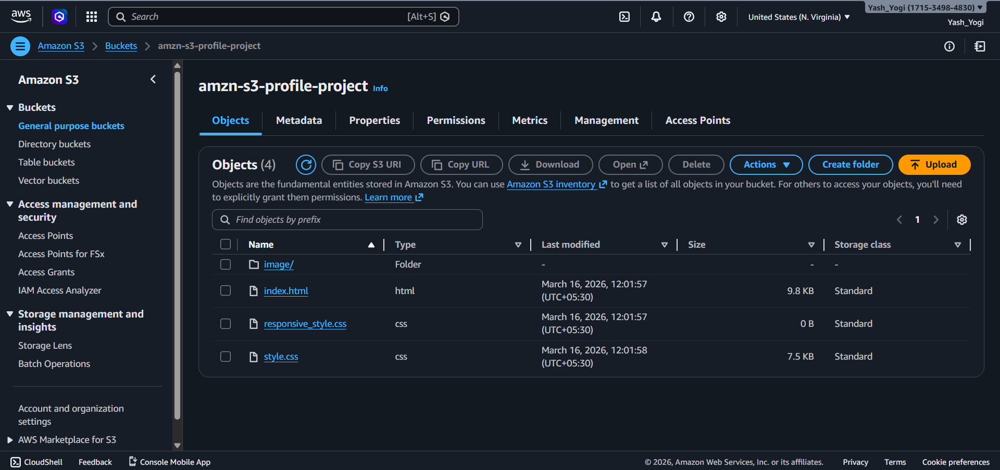
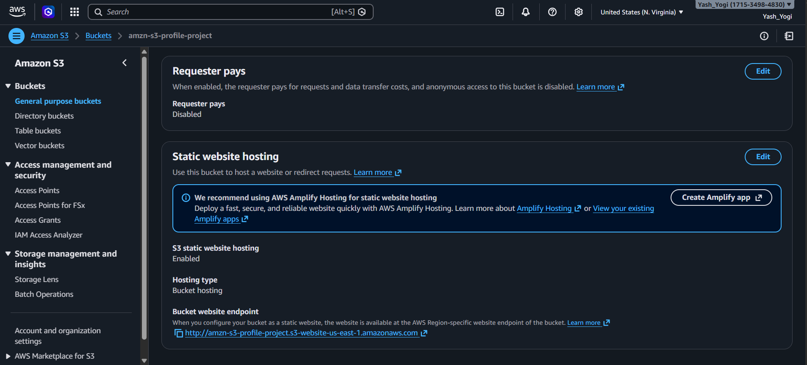
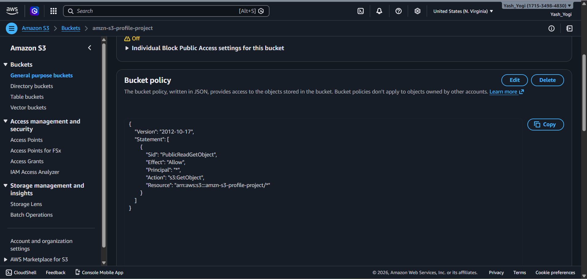
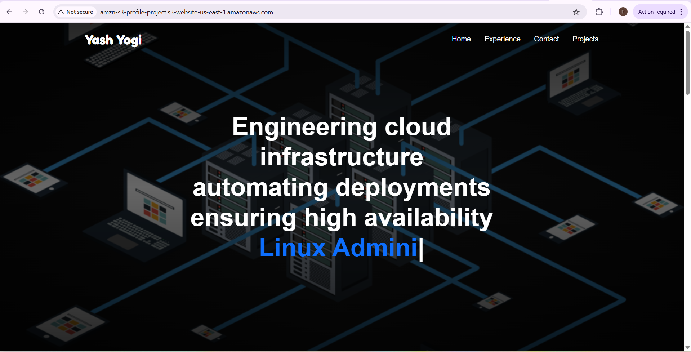

# AWS S3 Static Website Hosting

## Project Overview
Hosted a static website on AWS using Amazon S3 and configured 
it for public access using Bucket Policy.

## Architecture
```
index.html → S3 Bucket → Internet
```

## AWS Services Used
- **Amazon S3** - Storage and static website hosting
- **Bucket Policy** - Public read access configuration
- **Static Website Hosting** - Enabled via S3 properties

## What I Did
1. Created an S3 bucket on AWS
2. Uploaded index.html file to the bucket
3. Enabled static website hosting in bucket properties
4. Disabled block public access settings
5. Added bucket policy to allow public read access
6. Accessed the live website via S3 endpoint URL

## What I Learned
- How to create and configure an S3 bucket
- How to enable static website hosting on AWS
- How to write and apply a bucket policy
- How public access and permissions work in AWS S3

## Screenshots
### S3 Bucket with Uploaded Files


### Static Website Hosting Enabled


### Bucket Policy Applied


### Live Website



## Live URL
(http://amzn-s3-profile-project.s3-website-us-east-1.amazonaws.com/)

## Author
**Yash Kumar Yogi** | IT Executive transitioning to AWS Cloud Engineer
